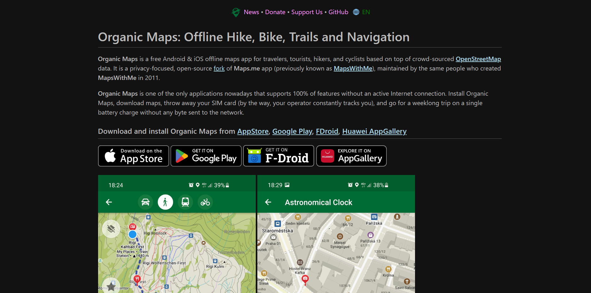

# Organic Maps Website

This static website is built with [Zola](https://www.getzola.org/) and Cloudflare Pages.



## Development

Download the latest zola (version 0.17.2 at the time of writing) for your operating system and set up the necessary path variable.

Run `zola serve` for a local preview or `zola build` to generate static site in the `public` folder.

Run `npm i && npm run format` when you want to pretty-format the Markdown and SCSS files.

Upgrade npm dependencies with `npm run upgrade`, make sure that you have installed `npm-check-updates` package.

## Deployment

Every PR deploys a preview version of the site at unique url.

Every merge into the _master_ branch deploys changes into the production at https://organicmaps.app

### Updating News

Run `npm run news` to automatically download news from our [Telegram channel](https://t.me/OrganicMapsApp),
then create a git commit and push it.

An example of a news post that is related to app updates/releases:

```yaml
title: "OpenStreetMap login was fixed in Google Play"
date: 2024-03-18T17:45:35+00:00
slug: "openstreetmap-login-was-fixed-in-google-play"
taxonomies:
  news: ["Releases"]
```

For external links and press releases use this taxonomy:
```yaml
taxonomies:
  news: ["Press"]
```

## Taxonomy and F.A.Q. architecture

Each MD page in `/faq/` has one or more taxonomy defined in header. E.g.:

```yaml
taxonomies:
  faq: ["Android"]
```

Zola collects all such taxonomies:

| File                 | Taxonomy key | Taxonomy value |
| -------------------- | ------------ | -------------- |
| android-lags.md      | `faq`        | `Android`      |
| android-logs.md      | `faq`        | `Android`      |
| general-team.md      | `faq`        | `General`      |
| general-bugreport.md | `faq`        | `General`      |
| ios-versions.md      | `faq`        | `iOS`          |
| map-longtap.md       | `faq`        | `Map`          |
| ...                  | ...          | ...            |

After that Zola gets all values for `faq` taxonomy: `[General, Android, iOS, Map, ...]`. And generates pages:

- For key `/faq/` with the list of values (see `templates/faq/list.html`)
- For each value `/faq/general`, `/faq/android`, etc. with the list of questions (see `templates/faq/single.html`)

If you want to add new question then create .md file with header:

```yaml
title: A full question that is the title of the page
description: More detailed info with necessary keywords for better SEO
slug: the-url-of-the-page-that-can-be-localized-for-better-seo
taxonomies:
  faq: ["General"]
extra:
  order: 40
```

Zola will add your question to specific F.A.Q. sub-page.

If you need to translate the FAQ to a new language please add next lines to config.toml:

```toml
[languages.XX]
taxonomies = [
  {name = "faq", feed = false},
]
[languages.XX.translations]
faq-menu-title = "{Translation of 'F.A.Q.' to a new language}"
```

**Limitation**: List of taxonomies at `/faq/` page is always alphabetical. So 'Android' is always the first, 'Bookmarks' is the second, 'General' is the third and so on.

**Limitation**: Questions at any F.A.Q. sub-page are sorted by file name. An `extra.order` variable in .md content files is used for sorting articles.

**Limitation**: Each F.A.Q. sub-page has only a name. No description, no icon. Only name 'Android', or 'iOS', or 'Routing', etc.

## Contribution

Any good ideas and help with web site improvement are appreciated. And it's always better to discuss
any improvement before implementing it to sync with our vision and plans.

## Translations

Please help us with translating this web-site in your language. See [TRANSLATIONS.md](TRANSLATIONS.md) file for detailed instructions.
