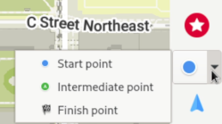
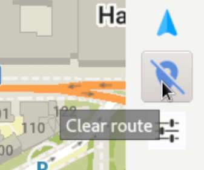
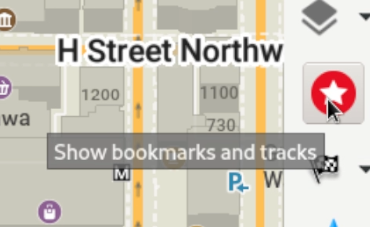

To install OM on Linux with flatpak, open the terminal and input `flatpak install flathub app.organicmaps.desktop`

Once the app is installed you can use the scroll wheel of your mouse or the controls on the right menu bar to zoom into the area you wish to navigate in order to download maps for that area. You can also click the "download" icon in the lower right. Once you have downloaded maps for the regions you care about, the app should work even without an internet connection. 

You can hover your mouse over the various icons to see some help text. 

To perform routing and turn by turn navigation, you have a couple of options. if you know the gps cordinates of your starting point and ending point, you can click the settings icon (above the green checkmark) and input the cordinetes of your starting point and destination. To set the starting point on the map itself, click the navigation icon and select "start point", then hold down the shift key and left click on the map. To set the destination, change to "end point" and click a location on the map.

You can click the blue icon directly above settings icon to clear navigation. 

To search for addresses and destinations, click the magnifying glass and enter the address or search term.

To add a location to your bookmarks, hold down the Alt key and right click the place you want to bookmark. The bookmark may not be immediatly visible, to view and manage bookmarks you need to click the red star icon. 

Currently the Linux desktop app is mostly used for development purposes (automated testing and checking logic without having to compile for mobile) but it would be great if developers were able/willing to help improve its useability.
