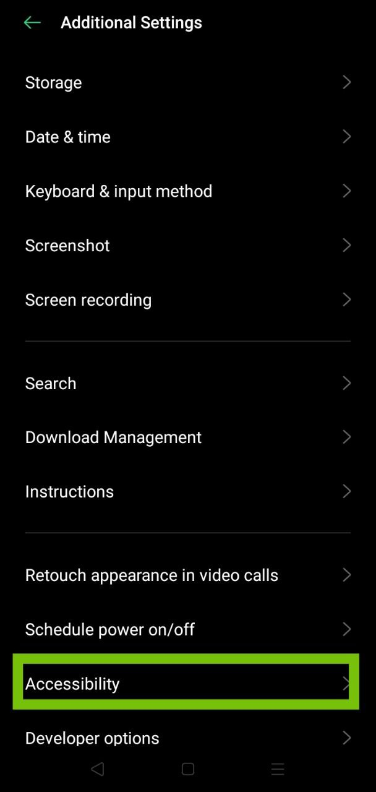

## Información general

Organic Maps utiliza el motor de texto a voz (Text-To-Speech, TTS) del sistema para las instrucciones de voz. Los motores predeterminados varían según el dispositivo, que puede ser el motor Text-To-Speech de Google, el motor del fabricante del dispositivo o un motor de terceros.

La recomendación oficial de Organic Maps es [RHVoice](https://rhvoice.org/), que es un motor de voz gratuito y de código abierto que se puede descargar desde [Google Play](https://play.google.com/store/apps/details?id=com.github.olga_yakovleva.rhvoice.android) y [F-Droid](https://f-droid.org/en/packages/com.github.olga_yakovleva.rhvoice.android/).

## Instrucciones

- Abra la aplicación de Ajustes de su dispositivo Android
- Vaya a Ajustes Adicionales y después a Accesibilidad
- Elija su motor preferido, el tono y la velocidad de la voz
- **Reinicie la aplicación Organic Maps**
- Abra Ajustes => Instrucciones de voz en Organic Maps y configúrelo
- Reinicie de nuevo la aplicación Organic Maps (o reinicie el dispositivo) si la voz no funciona.

Si no puede encontrar estos ajustes, abra la aplicación de Ajustes y busque "Instrucciones de voz".

Aviso: Note que estas instrucciones pueden variar en función de la marca de su dispositivo.

Estas opciones pueden que no estén disponibles si no tiene la funcionalidad TTS (Instrucciones de voz) instaladas en su dispositivo. Por favor, revise la tabla más abajo para instalar cualquier motor que soporte su idioma.

## Capturas de pantalla

|             |             |             |
| ----------- | ----------- | ----------- |
 | |

## Motores de síntesis de voz

A continuación se muestra una lista completa de los idiomas y los motores soportados para cada uno de ellos (los enlaces de descarga de cada motor se pueden encontrar después de la tabla):

{{ tts_table() }}

## Soluciones a problemas con RHVoice

Si tiene problemas para inicializar el motor de voz RHVoice en LineageOS o en otras ROM personalizadas, pruebe esta solución alternativa. Es posible que RHVoice no se inicialice correctamente y que la aplicación falle, especialmente si no ha utilizado ningún motor TTS en su teléfono antes (por ejemplo, una nueva instalación, un restablecimiento de fábrica, etc.). Si está utilizando una ROM personalizada como LineageOS <ins>sin los servicios de Google Play y los Servicios de Voz de Google</ins>, y desea utilizar RHVoice como su motor TTS preferido, siga las siguientes instrucciones como solución alternativa:

1. Instale el [motor eSpeak TTS](https://f-droid.org/en/packages/com.reecedunn.espeak) disponible en F-Droid.
2. Configúrelo como el motor del sistema preferido.
    - Vaya a los **Ajustes** principales de LineageOS.
    - Desplácese hacia abajo hasta **Accesibilidad**.
    - Seleccione **Salida de texto a voz** y **Motor preferido** (en el lado izquierdo) y asegúrese de que **eSpeak** esté seleccionado.
3. Regrese y pulse **Reproducir** para ver si está funcionando.
4. Instale [RHVoice](https://f-droid.org/en/packages/com.github.olga_yakovleva.rhvoice.android/), disponible en F-droid.
    - Ábralo, seleccione el idioma que desea usar, toque el ícono de la nube (extremo izquierdo) para descargar las voces.
    - Presione el botón de reproducción para verificar si está funcionando.
5. Configure **RHVoice** como motor preferido (vea el paso 2).
6. Ahora, debería poder utilizar RHVoice sin ningún problema.

## Prueba de la síntesis de voz

Para probar las instrucciones de voz, pulse en "Probar indicaciones de voz (TTS, Text-To-Speech)" en el menú "Ajustes → Instrucciones de voz" de OM, o puede iniciar una navegación para recibir cualquier salida de voz. Organic Maps no le dará instrucciones de voz si está parado.

