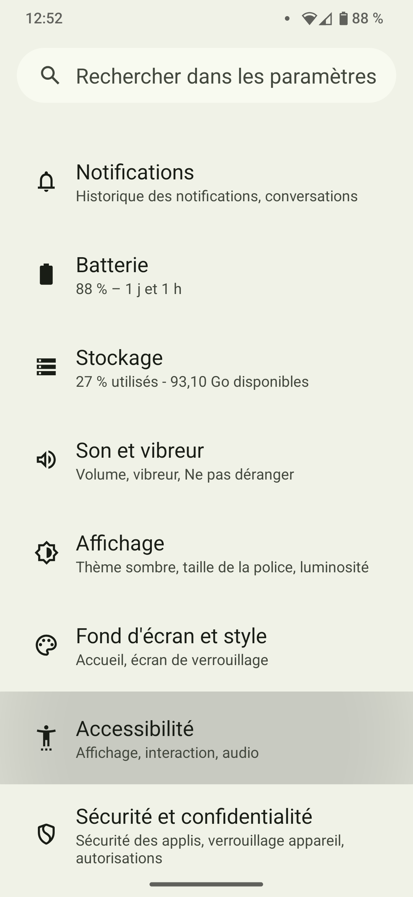
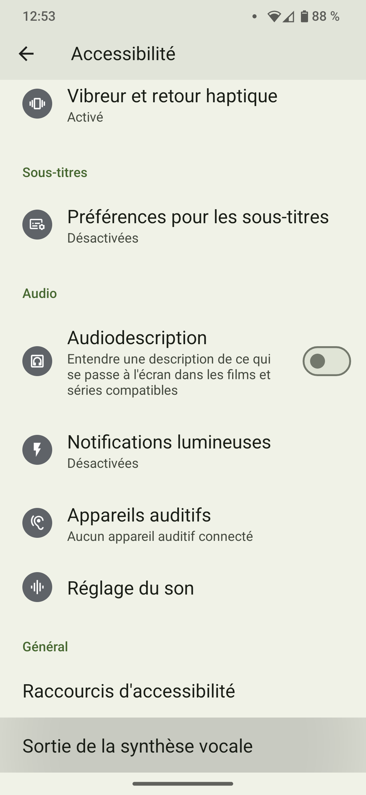
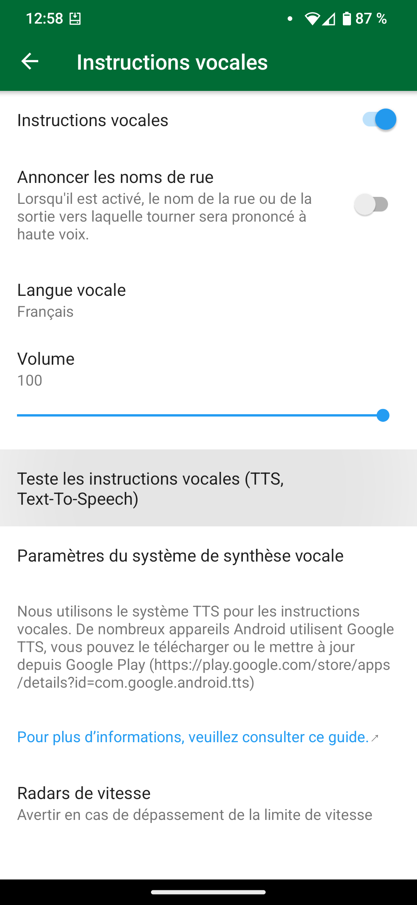

## Sommaire

Organic Maps utilise le moteur de synthèse vocale du système pour les instructions vocales. Les moteurs par défaut varient selon les appareils. Il peut s'agir de Google Text-to Speech, du moteur du fabricant de l'appareil ou d'un moteur tiers.

La recommandation officielle d'Organic Maps est [RHVoice](https://rhvoice.org/), qui est un moteur vocal libre et gratuit pouvant être téléchargé sur le [Google Play](https://play.google.com/store/apps/details?id=com.github.olga_yakovleva.rhvoice.android) et [F-Droid](https://f-droid.org/en/packages/com.github.olga_yakovleva.rhvoice.android/).

## Instructions

- Ouvrez l'application Paramètres sur votre appareil Android
- Sélectionnez Paramètres supplémentaires, puis Accessibilité
- Choisissez votre moteur, la vitesse d'élocution et la tonalité
- **Redémarrez l'application Organic Maps**
- Ouvrez Paramètres => Instructions vocales dans Organic Maps et configurez-les.
- Redémarrez l'application Organic Maps (ou redémarrez l'appareil) si la voix ne fonctionne pas.

Si vous ne trouvez pas le paramètre approprié, ouvrez l'application Paramètres et recherchez Text-to-speech.

P.S : Notez que ces étapes varient en fonction de la marque du téléphone que vous utilisez.

Ces options peuvent ne pas apparaître si aucun TTS n'est installé sur votre appareil. Reportez-vous au tableau ci-dessous pour installer l'un d'entre eux qui prend en charge votre langue maternelle.

## Captures d'écran

|             |             |
| ----------- | ----------- |
 | 

## Moteurs de synthèse vocale {#engines}

Vous trouverez ci-dessous une liste de plusieurs langues et moteurs et supportées (les liens de téléchargement se trouvent après le tableau) :

{{ tts_table() }}

## Solutions alternatives

Si vous avez des difficultés à initialiser le moteur TTS de RHVoice sur LineageOS ou d'autres ROMs personnalisées, essayez cette solution alternative. RHVoice peut ne pas s'initialiser correctement et l'application peut se bloquer, en particulier si vous n'avez jamais utilisé de moteur de synthèse vocale sur votre téléphone (nouvelle installation, réinitialisation d'usine, etc.). Si vous utilisez une ROM personnalisée comme LineageOS <ins>sans les services Google Play et Speech Services by Google</ins>, et que vous souhaitez utiliser RHVoice comme moteur TTS préféré, suivez les instructions ci-dessous comme solution de contournement :

1. Installez le [moteur eSpeak TTS](https://f-droid.org/en/packages/com.reecedunn.espeak) disponible sur F-Droid
2. Définissez le comme le moteur préféré du système
    - Allez dans les **Paramètres** de LineageOS.
    - Descendez jusqu'à **Accessibilité**.
    - Sélectionnez **Sortie de la synthèse vocale** et **Moteur préféré** (à gauche) et assurez-vous que **eSpeak** est sélectionné.
3. Revenez en arrière et appuyez sur **Lire** pour vérifier que cela fonctionne.
4. Installez [RHVoice](https://f-droid.org/en/packages/com.github.olga_yakovleva.rhvoice.android/) disponible sur F-droid.
    - Ouvrez l'application, sélectionnez la langue que vous souhaitez utiliser et appuyez sur l'icône du nuage (à gauche) pour télécharger les voix.
    - Appuyez sur le bouton de lecture pour vérifier qu'il fonctionne
5. Définissez **RHVoice** comme moteur préféré (voir étape 2)
6. Vous devriez maintenant pouvoir utiliser RHVoice sans problème.

## Tests

Pour tester les instructions vocales, vous pouvez cliquer sur "Tester les instructions vocales (TTS, Text-To-Speech)" dans le menu OM "Paramètres → Instructions vocales" ou vous pouvez démarrer la navigation pour entendre des instructions vocales. Organic Maps ne vous donnera pas d'instructions vocales tant que vous êtes à l'arrêt.

